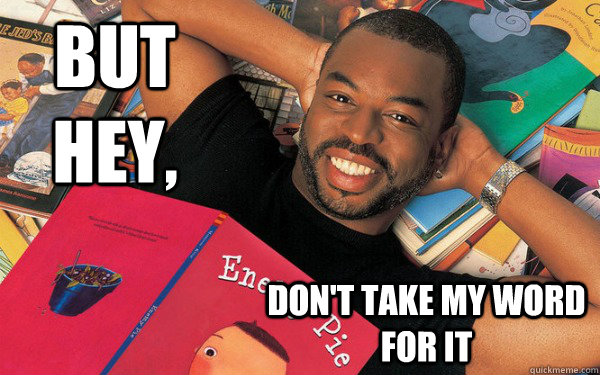

## Week 1: C (...and Apex)

### CS50 Week 1: C
Use the links below to catchup on CS50's week1 content: 

- [Lecture](https://www.youtube.com/watch?v=wEdvGqxafq8)
- [Notes](https://cs50.harvard.edu/college/weeks/1/notes/)

### ZS50 Week 1: Apex

#### Geneology
In week 1 of CS50 we were introduced to `C`, a low-level general purpose programming language. Salesforce's proprietary `Apex` programming language, though *not* general purpose (it only compiles and runs on Salesforce servers), expresses many syntactical and idiomatic similarities. Apex's closest general purpose cousin is `Java`, an object-oriented language built in many ways as a successor to earlier languages like C and C++, so it makes sense that many of the early paradigms have persisted. You will find this reuse and resilience of paradigms to be a common feature of programming languages, generally, should you decide to explore others. 

#### Core Concepts
According to the [Apex Developer Guide](https://developer.salesforce.com/docs/atlas.en-us.apexcode.meta/apexcode/apex_intro_what_is_apex.htm), Apex is a: 
> [...] **strongly typed**, **object-oriented** programming language that allows developers to execute **flow and transaction control statements** on Salesforce using syntax that looks like Java and acts like database stored procedures [...]

So that clears it up, yeah? 😏 Let's take a closer look at some of those terms.

##### Strongly Typed
`Strongly typed` means that you must declare the data type that a variable will hold at development time (versus `runtime`, which is when your code actually executes). Some other languages, like Javascript, are a bit more loosey-goosey (hence they are described as `loosely typed`) and allow dynamic variable declarations. Let's look at the difference: 

```java
// declare a String in Apex; note also that Apex requires Strings to be enclosed in single-quotes
String s = 'Hello, World'; 
// once declared, a variable can only contain data of the declared type, thus: 
s = 'new string';   // ...is fine
s = false;          // ...throws a compile exception
```

```javascript
// declare a string in Javascript
var s = 'hi there'; 
// double-quotes welcome here!
s = "new string"; 
// more flexibility here
s = true;           // ...no problemo
```

##### Object Oriented 
`Object-oriented Programming (OOP)` is, frankly, a pretty large topic. For now, let's just agree that: 

1. OOP languages use objects, and
2. Apex is a (class-based) OOP language 

So what is an `object`? An object is an instance of a `class`, which is a representation of...anything, really. A class defines both the characteristics that can be used to describe the thing (its `properties`) as well as what the thing can do (via its `methods`). 


If that seems like gibberish right now, don't sweat it. Let's take a look at an example: 

```java
// here we'll define an Apex class to represent a dog
public class Doggy{

    // properties define the ways you can describe any Doggy
    public String breed; 
    public String coatColor; 

    // methods define what a Doggy can do
    public void walk(){
        // go walking
    }

    public void bark(){
        // annoy the neighbors
    }
}

// now let's create a Doggy
Doggy d = new Doggy(); 
d.breed = 'Lab-mix'; 
d.coatColor = 'Brown'; 

d.walk(); // we're going for a walk
d.bark(); // woof
```

For now don't worry about the cryptic keywords like `public`, `void` etc. We'll get to those later.

##### Flow Control
Though it sounds like something from a prescription drug commercial, `flow control` refers to special statements, or `blocks`, that interrupt the typical *top-to-bottom, left-to-right* way in which code is executed. 

You saw examples of these flow controls in the week1 lecture, and they can be categorized as either `conditional` (think **if**, **else**, **else if**) or `iteration` (**for** loops). Flow control statements like **while** contain elements of both - and really all flow control is conditional, if you think about it - but it's a good mental heuristic for categorizing them. 

> You can find a description of each of the supported control flow statements in Apex [here](https://developer.salesforce.com/docs/atlas.en-us.apexcode.meta/apexcode/langCon_apex_control_flow.htm). 

The flow control types seen in `C` are very similar to those available in `Apex`, though the latter provides some additional functionality for working with objects on the Salesforce platform. 

Take some time to familiarize yourself with these...there may be a pset in your future that relies on your knowledge of them. 😮

## Questions You May be Asking Right Now

### Where do I declare `header files` in Apex?
A beautiful element of writing Apex is that you don't have to define header files like `stdio.h`. You can access any Apex class that's available in the org where your code will live, no "includes" required. 

The Apex compiler probably appends these includes for us dynamically when our code is deployed to the Salesforce servers, or performs some other "automagic" to make sure references are valid but...really...do we care how they do it? It *just works* and it saves us time 👍. 

### Okay, but how about my `int main (void)` method?
Don't need it. Again, Salesforce certainly has a methodology for invoking a main block of code during any given execution context, but we don't need to sweat how they do it. We just need to know how to declare the code we write (`triggers`, `classes`, etc.) so that Salesforce accesses it at the desired time. 

### Seems like the CS50 lecture covered more concepts than is covered here. 
Yep! Remember that ZS50 is a companion *resource* for applying the foundational concepts learned in CS50 to the specifics of developing on the Salesforce platform. The weekly lecture notes will cover the foundational elements we think are important, but there will likely be additional resources you'll need to tap into to round out your knowledge and complete the weekly challenges (**hint:** check out the *Related Content* section below). 

## Weekly Apex Challenge
Head on over to the [week1 challenges](../psets/week1.md) to start putting your newfound Apex-iness to practice! 

## Related Content
Here are some related resources you might like: 

### Read
* [Apex Developer Guide](https://developer.salesforce.com/docs/atlas.en-us.apexcode.meta/apexcode/apex_qs_core_concepts.htm)
* [Understanding Apex Core Concepts](https://developer.salesforce.com/docs/atlas.en-us.apexcode.meta/apexcode/apex_qs_core_concepts.htm)
* [Object Oriented Programming](https://en.wikipedia.org/wiki/Object-oriented_programming)

### Watch
#### CS50 Shorts
* [Conditionals](https://www.youtube.com/watch?v=1wsaV5nVC7g&list=PLhQjrBD2T381k8ul4WQ8SQ165XqY149WW&index=12&t=0s)
* [Command Line](https://www.youtube.com/watch?v=AI6Ccfno6Pk&list=PLhQjrBD2T381k8ul4WQ8SQ165XqY149WW&index=10&t=0s)


