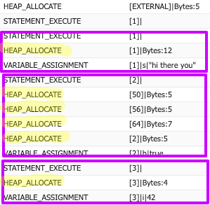

# Week 4: Memory

## CS50 Week 4
Use the links below to catchup on CS50's week3 content: 

- [Lecture](https://www.youtube.com/watch?v=ed2lnJNf7HU)
- [Notes](https://cs50.harvard.edu/college/weeks/4/notes/)

## ZS50 Week 4

If you watched CS50's week4 lecture and thought...

> *Oh no, not another week of pointers, linked lists and malloc. More like mallYUCK!*

...well, first of all, kudos on your mad pun skills 😂. Secondly, **you're in luck**! This is the first week where we begin to take more of a departure from the CS50 content to focus on the specificities of Salesforce dev, although the former's core concepts will still inform our discussion. 

### Back to Classes

Let's take a moment to review some core concepts we've learned so far about classes. 

> 1. Classes are blueprints for constructing objects. 
> 2. We can also refer to a given object as an `instance` of the class from which it was constructed. 
> 3. Classes are comprised of only two things: 
>       - Variables (characteristics of an object)
>       - Methods (things the object can *do*)
> 4. Objects live on the `heap`, and primitives (including object pointers, or references) live on the `stack`. 

Did we miss anything? We did not. Thus, we can confidently state that **the totallity of any Apex process is the interplay between objects and primitives**. 


Okay, that may be obvious but it's worth hammering home the point that there's no magic going on in any code (Apex or otherwise) ever written. It's all just objects, primitives and the logic working on them. That's great news for us as developers because it means the classes and objects we create can leverage a ton of functionality provided by the Apex language "out of the box".  

### Checking Out the (Standard) Library 📖

Most every programming language has a standard library - a bundle of functionality that comes with the language for performing common logic. C has [libc](https://en.wikipedia.org/wiki/C_standard_library); the [Python Standard Library](https://docs.python.org/3/library/) is called just that, as is [Java's](https://docs.oracle.com/javase/7/docs/api/index.html); Javascript has a relatively small [library](https://developer.mozilla.org/en-US/docs/Web/JavaScript/Reference/Global_Objects) but there is a [TC39 Proposal](https://github.com/tc39/proposal-javascript-standard-library) to expand it (see *https://github.com/stdlib-js/stdlib*). 

Apex is no different, and its standard library is documented under the [Apex Language Reference](https://developer.salesforce.com/docs/atlas.en-us.apexcode.meta/apexcode/apex_reference.htm) heading in the Apex Developer Guide. A couple things to note here: 

1. Classes are organized into logical `namespaces` based on what they do. You can think of a namespace like a folder on your computer, where the classes it contains are the individual files in that folder.
2. In some cases, if there is a naming conflict between a class in one namespace and the class in another, you'll need to write your code to reference the "fully qualified" class name (e.g. *\<namespace\>.\<className\>*), but this doesn't come up all that often. 

Let's take a look at some of the common namespaces and classes you'll use in your daily life as a Salesforce developer. 

#### [System Namespace](https://developer.salesforce.com/docs/atlas.en-us.apexcode.meta/apexcode/apex_namespace_System.htm)

The System namespace contains core functionality for working in Apex, several of which are described in more detail below. 

**Primitive Wrapper classes**

So, it turns out we've sort of fudged usage of the word "primitive" in prior weeks when referring to Apex primitive data types Although, the Salesforce docs use the same terminology so we get a pass 🙉. 

True primitives cannot have variables or methods - hence the term. Looking at the System namespace you'll see that every ["primitive"](https://developer.salesforce.com/docs/atlas.en-us.apexcode.meta/apexcode/langCon_apex_primitives.htm) Apex type has a class in this space, with exception of `Object`, whose name betrays it as obviously non-primitive. Most likely it is also an `abstract` superclass of the other primitive wrapper classes. But more on `abstraction` later. 

We can think of and refer to these classes as `wrapper` classes, because they wrap (in some cases) true primitives like `Booleans`, providing convenience methods that make primitives easier to work with. But, sure enough, when we use them in code they get allocated on the heap, not on the stack as a true primitive would. Run the following code in Anonymous Apex in your org and inspect the logs for the evidence: 

```java
// anon apex
String s = 'hi there you'; 
Boolean b = true; 
Integer i = 42; 
```

Your logs should look similar to the following: 



Now that our heap/stack 🎈 has been sufficiently burst, let's move on to discusing some other classes you'll use frequently in Apex development. 

**`Database` class**

The Database class is used for manipulating data - i.e. inserting, updating, and deleting records. You'll also find methods for common operations such as converting leads, merging duplicates, and dynamic querying. 

For many common operations you can also use DML statements such as `insert`, `update`, `upsert`, etc. rather than Database class methods. The Apex Developer Guide has a section devoted to [deciding when to use each](https://developer.salesforce.com/docs/atlas.en-us.apexcode.meta/apexcode/langCon_apex_dml_database.htm).

**`Exception` class**

It's great to be exceptional, right? Well, not so much in programming. An exception occurs when something goes wrong in your code at runtime (i.e. not a syntax or compilation problem, but something that's encountered during execution). 

Depending on the issue, the Apex runtime will throw one of the enumerable exception types described in this section. All of them share common methods such as `getMessage()`, `getStackTraceString()`, and others. Certain exception types provide additional information on what went wrong, such as the `DmlException` class's `getDmlFields()` and `getDmlType()` methods. 

It's nice that both the **Exception** class and the **Database** class live in the same namespace, because you'll often find they work well together in your programs. Wonder if that was intentional...😜


> ⏸ Aside (lengthy, but important)
> 
> This is a natural place to mention that, where your code is complex or you know that things *might* go wrong, it's a good idea (read: you absolutely should) wrap those lines in `try/catch` blocks. 
> 
> What do `try/catch` blocks do for you? They allow you to write handler logic for when things go wrong. Without them, an exception will cause your process to exit immediately with all database operations rolled back. Rather than allowing this to happen - referred to as an `uncaught exception` scenario - you should allow your code to "fail gracefully". 
> 
> Consider the following code. What happens if one of the Lead records in the list of Leads is missing a value in the `Company` field: 

```java
List<Lead> leadsToInsert = new List<Lead>(); 
// other code that populates the list of Leads for insertion
insert leadsToInsert; 
```

> Aaaarrrgh. You get an unhandled exception `System.DmlException: Insert failed. First exception on row 0; first error: REQUIRED_FIELD_MISSING, Required fields are missing: [Company]: [Company]`. So if you had 5,000 leads in that list, and only 1 was missing a value in the Company field, not only does that 1 lead not get inserted, but neither do the other 4,999. No bueno, right? 
> 
> A **good** ✅ implementation would wrap the `insert` statement in a try/catch block: 
```java
List<Lead> leadsToInsert = new List<Lead>(); 
// other code that populates the list of Leads for insertion
try{
    insert leadsToInsert; 
} catch(Exception e){
    system.debug(e.getMessage()); 
}
```
> A **better** ✅ ✅ implementation might use multiple catch blocks, knowing that the wrapped line is most likely to produce a `DmlException`, specifically: 
```java
List<Lead> leadsToInsert = new List<Lead>(); 
// other code that populates the list of Leads for insertion
try{
    insert leadsToInsert; 
} catch(DmlException de){
    system.debug(de.getMessage()); 
    Integer i = de.getDmlIndex(); 
    leadsToInsert.remove(i); 
    insert leadsToInsert; 
} catch(Exception e){
    system.debug(e.getMessage()); 
}
```
> The **best** ✅ ✅ ✅ implementation, assuming it's desirable to allow partial insertion, would utilize the `Databse.insert()` method which provides for this option, *and* wraps the line in a try/catch block. It may even use an inheritance trick to restrict the number of catch blocks to 1, allowing access to specific  `DmlException` type methods: 
```java
List<Lead> leadsToInsert = new List<Lead>(); 
// other code that populates the list of Leads for insertion
try{
    Database.insert(leadsToInsert, false); 
} catch(Exception e){
    // don't let your brain explode here 🔥
    // we'll cover what's going on in the Inheritance section below
    if(e instanceof DmlException){
        DmlException de = (DmlException) e; 
        system.debug(de.getDmlFieldNames());
    }
}
```
> To summarize, using `try/catch` blocks in your code is a really, really, really, really good idea and will save you from spending your hard-earned money on hair plugs down the line. Use them in places where code is complex, known exceptions are likely, or inputs are highly variable or unkown. As a first rule of thumb, **always wrap database operations in try/catch blocks**. 
>
> Whew. Now back to our regularly-scheduled programming.

**`JSON` class**

If you're writing any code that interacts with third-party web APIs, odds are they're going to return data in [json](format). Use this class to convert json strings to and from Apex data types. If you're working with Lightning Components, this is a must-have class.

**HTTP classes**

Utility classes for working with third-party web services reside here, as well, including the `Http`, `HttpRequest`, and `HttpResponse` classes.

If you want to *write* classes to act as handlers for requests inbound to your Salesforce org (read: create a custom Apex REST api) you'll want to check out the `RestContext`, `RestRequest`, and `RestResponse` classes.

**Collections classes**

You'll notice that `List`, `Map` and `Set` classes live in the System namespace. 

**`Schema` class**

The Schema class provides an important interface for accessing information about the org's object and field metadata using `Schema.getGlobalDescribe()`. For access to metadata about a specific SObject, see the `Schema` namespace below. 

**`SObject` class** <a name="sobjectClass"></a>

This is the superclass for all SObjects. It provides methods for dynamically accessing (`get()`) and setting (`put()`) an SObject's field values; adding custom errors to prevent dml operations against it (`addError()`); creating a cloned copy in memory (via `clone()`); and more. 

**`Test` class**

Unit testing the Apex classes you create is of tremendous import for ensuring the functionality and stability of your org. This class provides important methods for effecting unit tests, including `startTest()` / `stopTest()` for testing asynchronous processes, `loadData()` for data creation from a static resource, and others.

**`UserInfo` class**

The UserInfo class provides pertinent information regarding the runtime context user (user who initiated the current process), via methods including `getUserId()`, `getProfileId()`, and others.

#### [Schema Namespace](https://developer.salesforce.com/docs/atlas.en-us.apexcode.meta/apexcode/apex_namespace_Schema.htm)

The Schema namespace houses an important collection of classes for dynamically access metadata about specific SObject data types. Probably the most common usage is accessing speicific types via the dot (.) notator, such as `Schema.Account.sObjectType` or `Schema.My_Custom_Object__c.getSObjectType()`, both of which return an instance of the `SObjectType` class for the specified type. 

See [Using the Schema Namespace](https://developer.salesforce.com/docs/atlas.en-us.apexcode.meta/apexcode/apex_classes_schema_namespace_using.htm) for more examples. 


### Inheritance

#### Abstract Classes

We used the terms `abstract` and `superclass` to refer to several Apex data types above. So what is that all about, and how do they relate to this new term, `inheritance`? 

Inheritance is, thankfully, another programming term that is self-describing. It refers to the fact that one class can *inherit* properties and methods from a parent class. We may also refer to these parent classes as a `superclass` or `base class` to the classes that extend them. We'll use the term *superclass* as it also serves as a helpful reminder for some syntax we'll look at shortly. 

Often, these superclasses are also *abstract*, meaning that they can't be constructed directly. Only one of the subclasses which `extends` - again, a term that doubles as a syntax reminder - the base class can be constructed. 

A quick example should bring this all together for us. First we'll create the superclass. Notice the addition of the word `abstract` to the class definition. This modifier means that the class can be extended by other classes, but itself cannot be constructed. 

```java
public abstract class SObjectDomain{

    private List<SObject> records;

    // abstract classes still can, and often do, define constructors
   
    public SObjectDomain(List<SObject> records){
        this.records = records; 
    }

    /*
     * We also add the 'abstract' modifier to this method's definition. 
     * When added to a method, it means that any extending class
     * must provide the implementation - the code between curly 
     * braces. Because of this, we ommit the curly braces here. 
     * Abstract methods can only be added in abstract (or virtual)
     * classes.
     */
    public abstract void doBeforeInsert(); 

    /*
     * You can still write methods that have an implementation, and
     * any extending subclass gets access to them, like the two
     * methods below. 
     */
    public Integer getRecordsSize(){
        return this.records.size(); 
    }

}
```

Now that we have our abstract class, let's add an extending class that can actually be constructed. We have added `extends SObjectDomain` to the end of the class definition. Now AccountDomain is a subclass of SObjectDomain. This means a few things: 
1. AccountDomain **must** implement any of the abstract methods defined in SObjectDomain.
2. AccountDomain **may** utilize constructors defined in SObjectDomain.
3. AccountDomain **may** utilize any non-abstract methods defined in SObjectDomain. 

With these rules in mind, let's build out our AccountDomain subclass: 

```java
public class AccountDomain extends SObjectDomain{

    /*
     * Remember when we said that the term `superclass` is a good
     * syntax reminder? Here we see why, as we call super() to  
     * utilize constructors defined by the superclass.
     */
    public AccountDomain(List<Account> accounts){
        super(accounts); 
    }

    /*
     * We add a little extra syntax to the methods requiring
     * implementation, via addition of the `override` keyword.
     */
    public override void doBeforeInsert(){
        // things to do before inserting Accounts
    }
}
```

If you looked closely 🔍 at the code above you may be asking, *"The constructor for SObjectDomain takes an argument of List\<SObject\>. Yet, when we utilize it via `super()` in AccountDomain, we're passing a List\<Account\>. I thought we had to respect argument types! Won't that throw a compilation error?!"*


Astute observation! You'll recall we stated above that the `SObject` class is the superclass of all SObject types (Account, Case, My_Custom_Object__c, etc.). So what we're seeing is a major **benefit** of inheritance known as `polymorphism` - the ability for subclass objects to be treated as interchangeable with their superclass. 

This actually makes intuitive sense when you remember the first rule we outlined for the AccountDomain class above. **AccountDomain **must** implement any of the abstract methods defined in SObjectDomain.** Looking at a concrete example, lines 1 and 2 below will have an identical result to lines 3 and 4. 

```java
// assume List<Account> `accounts` created previously...
AccountDomain ad = new AccountDomain(accounts); 
ad.doBeforeInsert(); // works fine
SObjectDomain sd = new AccountDomain(accounts); 
sd.doBeforeInsert(); // works fine
```

But *why* should that work? Because in practical terms, what you're defining in a superclass is a **contract** that any of its **subclasses must honor**, and that any **caller can rely upon**. 

*Okay, okay, so subclasses can be used interchangeably with their superclass parents and we call that polymorphism. Sounds very fancy and all - but what does that **mean** to me?*

The practical effect of using inheritance is that you can write code that is more stable and efficient. We saw in our SObjectDomain class that we can write methods that provide implementation to subclasses. `getRecordsSize()` is a pretty trivial example, though. Let's add another method to our SObjectDomain class that's more useful: 

```java
// ... other SObjectDomain code

public Boolean fieldsAreNotNull(List<Schema.SObjectField> fields){
        // loop through each record
        for(SObject record : records){
            // loop through each field, ensuring value is non-null
            for(Schema.SObjectField field : fields){
                if(record.get(field) == null){
                    // if any field is false, return right away
                    return false; 
                }
            }        
        }

        // if all fields are non-null, return true
        return false; 
    }
```

Now we have a method with some power!🏋 So, imagine you have a need to validate that a list of fields are non-null in various types of SObjects (Account, Contact, Lead, etc.). Rather than re-implementing (read: re-writing) all that logic in various classes for each SObject type, now you can simply have those classes extend the SObjectDomain class and they get automatic access to the `fieldsAreNotNull()` method. 

Revisiting our stated benefits above, this makes your code more: 
1) **Stable**. Because you're not duplicating logic in multiple areas, there are less places for things to go wrong. You have also defined an iron-clad contract. 
2) **Flexible**. If you do find a bug there's one place to fix it. Or maybe you find a more efficient way to implement the logic - again, you only need to refactor in one place. Suppose you find other common things that all subclasses can benefit from - just add another method in one place and, boom 💥, all subclasses get access to it. Finally, **any methods that use the superclass as a return type or argument type can leverage the power of polymorphism.**

That last one's a big one. If you have a method that you know needs to utilize some functionality in SObjectDomain, but you don't necessarily know at write-time what *concrete* type you'll be getting, the superclass is your best friend: 

```java
public class SomeClass{
    public static void someMethod(SObjectDomain sod){
        // do some logic with sod
    }
}

// calling code, assume some List<Account> `accounts` already created
AccountDomain ad = new AccountDomain(accounts); 
SomeClass.someMethod(ad); // works just dandy
```

Plus, you still have the flexibility of taking advantage of any additional functionality that AccountDomain has added beyond the contract required by SObjectDomain. This is possible via another handy feature enabled through inheritance, called `casting`. 

Let's look at an example, assuming in our AccountDomain class we've added a `uniqueAccountMethod()` to that class:

```java
public class SomeClass{
    public static void someMethod(SObjectDomain sod){
        // do some logic with sod
        // now let's do some specific AccountDomain stuff...
        if(sod instanceof AccountDomain){
            AccountDomain ad = (AccountDomain) sod; 
            ad.uniqueAccountMethod(); 
        }
    }
}
```

So what are we doing in our `if` block? 
- First, we're utilizing the Apex keyword `instanceof` to check if **sod** is an instance of the AccountDomain class. 
- If it is, we declare a variable of type AccountDomain named **ad**, and *cast* the object **sod** to it.
    - Tying this to our discussion of memory, we are creating a new object on the heap when we use casting. The original object (**sod** in this case) is not itself changed. 
- After we've casted to the specific type we can access all instance variables and methods available in it. 

One note about casting before we move on: **you can only cast an object of a parent (superclass) type "down" to a child (subclass) type.** You cannot cast "up" the hierarchy chain.

Whew...

Okay, if you're feeling a bit disoriented right now...


...don't sweat it! This whole inheritance thing can take a bit of getting used to, and we'll try to tie everything in a bow in the *Wrap Up* section below. Before we get there, though, let's look at the one other type of inheritance available to you in Apex. 

#### Interfaces
After reading the previous section you may have wondered, *So what happens if I want my class to inherit from **multiple** superclasses?* 

For once, there's a nice, simple answer: you can't. Well, at least not with abstract classes. An Apex class can only `extend`, and inherit directly from, one class. 

What you **can** do, however, is `implement` any number of `interfaces`. So what's an interface, and how is it different from an abstract class? 


#### With Great Power...

`IS-A versus HAS-A`

`SOLID`

## Wrap Up

# Related Content

## Read

- [The Java Tutorials: Polymorphism](https://docs.oracle.com/javase/tutorial/java/IandI/polymorphism.html)
- [Apex Keywords](https://developer.salesforce.com/docs/atlas.en-us.apexcode.meta/apexcode/apex_classes_keywords.htm)
- [Apex Developer Guide: Classes and Casting](https://developer.salesforce.com/docs/atlas.en-us.apexcode.meta/apexcode/apex_classes_casting.htm)

## Watch

### CS50 Shorts

- [Data Structures](https://www.youtube.com/embed/3uGchQbk7g8?autoplay=1&rel=0)
- [Hash Tables](https://www.youtube.com/embed/nvzVHwrrub0?autoplay=1&rel=0)

## Code

