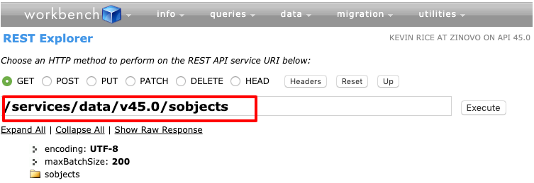

# Week 5: HTML, HTTP, CSS

## CS50 Week 5
Use the links below to catchup on CS50's week3 content: 

- [Lecture](https://www.youtube.com/watch?v=uEmF74eHRO8)
- [Notes](https://cs50.harvard.edu/college/weeks/5/notes/)

## ZS50 Week 5

CS50 did a good job of describing the basic circuitry of the internet in their week5 discussion, so we'll focus on filling out the picture with a bit more depth and Salesforce-specific context. 

### HTTP

HTTP, the `Hypertext Transfer Protocol`, is something we utilize literally every day in modern life. As enterprises move their mission-critical applications off-premise and into the cloud, it's also become an increasingly important piece of technology for the global economy. Of course, as Salesforce developers we already know this: 


So HTTP is kind of a big deal. But it's just one of many protocols that lives atop two other technologies which, due to their interdependence in networking applications, are almost always discussed together: `IP` (Internet Protocol) and `TCP` (Transmission Control Protocol). 

CS50 touched on these lightly and, really, they're so low-level that we don't need to know too much about them. Suffice to say that IP dictates the route by which a client and server find each other as well as the means by which the data they exchange gets "chunked" into smaller `packets`. TCP, on the other hand, dictates where those packets get sent once they are on the requested machine. An apt analogy is to think of IP as a carrier service like UPS that is delivering a package to a large apartment complex. UPS (IP) delivers the package to the front desk, but it's the concierge (TCP) that ferries it to its final destination *inside* the building (it's a fancy apartment complex 😉).

So, if `TCP/IP` handles the bundling and delivery of data on the web, what does HTTP do? It defines the rules around how clients *request* resources and the *response* format that the server must implement. These rules cover a number of things, but we'll focus on two: `request methods`, and request and response `bodies`. 

#### Request Methods

Requests on the web can be made by a client via a limited amount of methods. Method in this context isn't the same thing as a method defined in an Apex class - it simply refers to the type of request being made (sometimes referred to as the request "verb"). Some of the most common are: 

- `GET`: request a resource from server with no other effects
- `POST`: create a new instance of the given resource type on the server
- `PUT`: update an existing resource on the server
- `DELETE`: remove a resource from the server

You'll notice all the methods above revolve around `resources`. That is because every - *every* - URL on the web represents a resource. That fact is actually made plain in the acronym itself - [Uniform Resource Locator](https://en.wikipedia.org/wiki/URL#Syntax). Whether you're browsing a website or interacting with an API from the command line, if you're using HTTP, you're acting on resources.

#### Bodies

Like an HTML page, HTTP messages (requests and responses) consist of a [`header`](https://en.wikipedia.org/wiki/List_of_HTTP_header_fields#Request_fields), representing the metadata of the message and, optionally, a `body` containing message data. 

So what's in a body, and what's it used for? Let's start with the second part of the question. Remembering that we work on resources over HTTP, message bodies are most often used to represent a resource that needs to be created or updated (`POST`, `PUT`), or that is returned from the server (`GET`). 

The `content-type`, the data that makes up a body, is dependent on the server resource being acted upon. There are many valid types and Mozilla Developer Network (MDN) lists some of the more common ones [here](https://developer.mozilla.org/en-US/docs/Web/HTTP/Basics_of_HTTP/MIME_types/Complete_list_of_MIME_types). 

The one that you really need to know, though, and which is used in the vast majority of web services built today, is `JSON` (Javascript Object Notation). Despite its name, you don't need to learn Javascript to work with JSON. It is a language-independent data exchange format. 

[JSON](https://www.w3schools.com/js/js_json_intro.asp) is a lightweight format that is simply a collectin of name / value pairs. Names must be enclosed in double quotes (`"`), and values must be one of a handful of valid "primitive" types, including `string`, `number`, and `boolean`, as well as compound types `object` or `array`. Let's take a look at a simple example that might be used to represent the ZS50 class: 

```json
{
    "locale": "english",
    "primaryLanguage": "Apex", 
    "additionalLanguages": ["C", "Java", "Javascript"],
    "exuberantUseOfGifs": true, 
    "cornyPuns": true,
    "urls": [
        { "baseUri": "https://alpha-bytes.github.io/zs50-content" },
        { "challenges": "/psets/list.html" },
        { "lectures": "/lectures/list.html" }
    ]
}
```

### Time for a `REST`

Let's review what we've covered so far: 
- every URL on the web represents a resource
- those resources are of some specific data type
- many APIs today utilize the JSON data type to represent resources

Okay, so let's start transforming these concepts into concrete examples. As we saw in CS50, when you make a request to a website you can use Chrome's [Developer Tools](https://developers.google.com/web/tools/chrome-devtools/) to view the network activity corresponding to your request. So, when you go to https://login.salesforce.com you should see something like the following as the first "network" entry: 


The remaining items are all the additional resources the browser loaded for you in order to construct the final page that you ultimately see. Mostly these are HTML, CSS, JS (Javascript) and image files (.png, .svg, etc). 

So that's how we experience Salesforce through the browser. Of course, we also know there are ways to access Salesforce that don't require a UI, the two primary means of which are the Salesforce `SOAP` and `REST` APIs. We won't cover the former as it's an older protocol that's generally used for implementations to legacy software. Instead, we'll focus on the shiny and bright REST API. 

> *So what does REST stand for, anyways?* 
> 
> Representational State Transfer
> 
> *Which is...*
> 
> An architectural style for creating web services that prescribes a set of constrainst used to provide interoperability between computers on the internet through stateless operations on resources.
> 
> *I hate you.*

REST is a concept that has fueled religious debate and fundamentalist fury in the development community since its introduction in 2000. Based on the definition above, you can probably see why. So, rather than dissecting what it is, we'll focus on the practical aspects of using (and building, see *Apex REST* below) RESTful APIs. 

So, here are the practical things to know about RESTful web APIs: 
- URLs (also sometimes called "endpoints") represent a resource
- HTTP methods are used canonically (e.g. GET means "retrieve", POST means "create", etc.)
- Message bodies are typically in JSON format, though XML is sometimes supported

With these guidelines in place, let's see how we can put REST to use in our lives as Salesforce developers. 

#### The Standard REST API
The Salesforce REST API provides a plethora of resources for interacting with platform data and metadata. You can read about each of the resources in the [REST API Developer Guide](https://developer.salesforce.com/docs/atlas.en-us.api_rest.meta/api_rest/intro_what_is_rest_api.htm), but where's the fun in that? Let's use the API itself to tell us all of the resources that are available to us. 

The easisest way to begin exploring the REST API is through the (unofficial) Salesforce tool [Workbench](https://workbench.developerforce.com/). Log in using your ZS50 org credentials (the same one you use for challenges), and then navigate to **utilities > REST Explorer**. You should see a screen like the following: 


Note the following sections: 
1. Select the Http method to apply to your request. If you select `POST`, `PUT` or `PATCH` you will be able to enter a message body. 
2. You can enter a URL directly, or it will pre-fill for you (see subsequent steps). The URL shown above is the "base URL" for the REST API, and the resources available are determined by API version. Versions correspond to the latest core Salesforce release, which as of this writing is **Spring '19** (version 45.0). 
3. Buttons allow access to enter custom message Headers, reset to the base URL (shown), or move one level "up" the URL hierarchy. 

So, to get started fire up that ol' **Execute** button. You'll now see the list of all the available resources in version 45.0 displayed as clickable hyperlinks. Click the **sobjects** link to view that resource. You'll notice the URL input field changes to reflect the current resource: 



There is a specific SObject resource for every standard and custom object available in the org through which you're accessing the API. Click the "sobjects" folder icon to expand it, and then click the "Account" sub-folder, "urls", and finally "sobjects". Your url field should now show: 
`/services/data/v45.0/sobjects/account`. If it doesn't, just copy and paste that into the field, and hit the Execute button. 

Okay, so what we're viewing here is the primary Account resource. You'll notice you can expand the `objectDescribe` folder to view some basic metadata about the Account object. 

Remember how most REST APIs these days utilize the JSON format? So does the Salesforce REST API. Click the **Show Raw Response** link to toggle a view of the raw HTTP response message sent from Salesforce. The first block of lines in the response are the `headers`, followed by the `body` JSON after the empty line. Workbench is taking the raw response, and from it generating a handly little UI for crawling the API. Nice, right?


So now we know have a handly tool for exploring the REST API. But that's only part of the story - thus far, we've only been utilizing `GET` requests. Useful for retrieving information, but to effect any resource *changes* we'll need to make use of those Http method radio buttons. 

Let's have some fun. Click the `POST` radio button from your current location (`/services/data/v45.0/sobjects/Account`). Notice you can now input a request body. Copy and paste the following into the Request Body input and click Execute: 

```json
{
    "name": "ZS50 House Account"
}
```

Your raw response should look like the following (with a different value for `id`, of course): 

```http
HTTP/1.1 201 Created
Date: Wed, 29 May 2019 20:47:51 GMT
Strict-Transport-Security: max-age=31536002; includeSubDomains
Public-Key-Pins-Report-Only: pin-sha256="9n0izTnSRF+W4W4JTq51avSXkWhQB8duS2bxVLfzXsY="; pin-sha256="5kJvNEMw0KjrCAu7eXY5HZdvyCS13BbA0VJG1RSP91w="; pin-sha256="njN4rRG+22dNXAi+yb8e3UMypgzPUPHlv4+foULwl1g="; max-age=86400; includeSubDomains; report-uri="https://a.forcesslreports.com/hpkp-report/00D1U0000014EPgm";
Expect-CT: max-age=0; report-uri="https://a.forcesslreports.com/Expect-CT-report/00D1U0000014EPgm";
X-Content-Type-Options: nosniff
X-XSS-Protection: 1; mode=block
X-Robots-Tag: none
Cache-Control: no-cache,must-revalidate,max-age=0,no-store,private
Set-Cookie: BrowserId=B5RFRHQyTxacNOkzeLKfMA;Path=/;Domain=.salesforce.com;Expires=Sun, 28-Jul-2019 20:47:51 GMT;Max-Age=5184000
Expires: Thu, 01 Jan 1970 00:00:00 GMT
Sforce-Limit-Info: api-usage=12/15000
Location: /services/data/v45.0/sobjects/Account/0011U00000V0tkDQAR
Content-Type: application/json;charset=UTF-8
Vary: Accept-Encoding
Content-Encoding: gzip
Transfer-Encoding: chunked


{
  "id" : "0011U00000V0tkDQAR",
  "success" : true,
  "errors" : [ ]
}
```

Did we just create an Account through the REST API? You bet we did. To confirm, let's retrieve it from the REST API. We'll do this by switching back to a `GET` method and appending the returned id to our base Account resource, as such: `/services/data/v45.0/sobjects/Account/<yourIdHere>`. You should get a `200` status response from the server, along with a body of all the Account fields and some additional attributes about the record. Now you can confidently tell all those API naysayers: 


We've only touched on the things you can do with the standard REST API. To learn more check out the full documentation and/or spend some time tinkering via Workbench or your command-line tool of choice. Just make sure you're not logged into a customer prod instance - tinkering tends to be frowned upon in those orgs 😛.  

#### Outbound Http in Apex
We have explored how to access the standard Salesforce REST API. Now, let's switch gears and see how we can access *any* API from inside the Salesforce runtime, via Apex. Salesforce makes this a relatively simple exercise, by way of `Http`, `HttpRequest` and `HttpResponse` classes we first caught a glimpse of last week in the `System` namespace. 

For our example we'll access the open-source [SWAPI](https://swapi.co/) API, the first (and only?) API dedicated to fulfilling your *Star Wars* universe data needs 🙌 😛. We can break the process into three steps: 
1. Build the request (`HttpRequest` instance)
2. Send the request (`Http.send()` static method)
3. Work with the result (`HttpResponse` instance)

**Build The Request**

SWAPI has 6 resources that we can access. In our case, we're just raaaaaahhgh to know about our favorite Star Wars character, Chewbacca. We'll use the SWAPI `people` resource to get more details. 

First we'll create a new instance of the [HttpRequest](https://developer.salesforce.com/docs/atlas.en-us.apexcode.meta/apexcode/apex_classes_restful_http_httprequest.htm#apex_classes_restful_http_httprequest) class, and populate the pertinent values: 

```java
// create new instance
HttpRequest request = new HttpRequest(); 
// lets define our http method first
request.setMethod('GET'); 
// now let's set our destination; SWAPI resources support search via a URL param, so we'll include that
request.setEndpoint('https://swapi.co/api/people/?search=chewbacca'); 
```

There are several other methods you can utilize, including `setHeader()` and `setBody()`, but for our example that's all we need. 

**Send the Request, Inspect the Result**

Next, we'll use a static method on the `HTTP` class to execute our request, and inspect the result via `HttpResponse` instance methods: 

```java
// ... other code from above
// Http.send() returns an instance of HttpResponse - just what we need!
HttpResponse response = Http.send(request); 
// first, let's make sure we received a success response
if(response.getStatusCode() == 200){
    // assuming it did, let's inspect what was returned
    String resBody = response.getBody(); 
    /** 
      * SWAPI returns data in JSON format, so we'll use the handy System.JSON class to help us work with it
      * JSON.deserialize() takes a String of properly-formatted JSON, and "deserializes" it 
      * (converts from String to a complext type). Let's assume here that we've created a 
      * StarWarsPerson class with all the possible properties that SWAPI could return in a response. 
      * JSON.deserialize() can also only return a generic Object type, so we'll need to use that fancy 
      * casting ability we learned about last week to cast down to our specific type. 
      **/ 
    StarWarsPerson chewwy = (StarWarsPerson) JSON.deserialize(resbody); 
    // let's learn more about Chewbacca!
    system.debug(chewwy.birth_year); // 200BBY
    system.debug(chewwy.eye_color); // blue (really??)
    system.debug(chewwy.homeworld); // https://swapi.co/api/planets/14/ - we can use this to explore the API programmatically!
    system.debug(chewwy.url); // https://swapi.co/api/people/13/ - this is the resource URL for Chewbacca - check it out in your browser to confirm these results!
} else {
    // write the issue to the debug logs
    system.debug('Uh oh. Something went wrong. Server response: status ' + response.getStatusCode()); 
}
```

And that's it - we've just worked with an external API in Apex. One note: most APIs you'll use in a professional context will require some type of authentication. Sometimes OAuth, but in most cases at least an API "key" so that the provider can track usage and prevent abuse. For basic authentication like this, consider using the [Named Credential](https://developer.salesforce.com/docs/atlas.en-us.apexcode.meta/apexcode/apex_callouts_named_credentials.htm) feature in Salesforce rather than hard-coding API keys or username/password credentials. You'll thank yourself during security review 😎. 

#### Inbound Http in Apex (Apex REST)

What if we want to build our own REST resources on Salesforce to extend or abstract what's available via the standard REST API? Is that possible? Well, of course, otherwise there wouldn't be a section for it, right? 

In fact, exposing custom REST endpoints for external consumers (business partners, consumers, etc) is pretty straight forward. Following are the basic steps: 
1. Create a `global` Apex class that will be your handler for requests, and apply the `@RestResource` annotation to it
2. Define a relative URL for your resource. This will be appended to the base `https://<yourinstance>.salesforce.com/services/apexrest/` resource and must be unique in your org. 
3. Create one static *class* method for each *HTTP* method you'll support, and apply the appropriate annotation. Only one method may be defined for each [supported](https://developer.salesforce.com/docs/atlas.en-us.apexcode.meta/apexcode/apex_rest_annotations_list.htm) HTTP verb.  
4. Watch the requests roll in!

Okay, so let's see a concrete example. Continuing our prior example, let's say we're hosting a Star Wars convention and have set up a web page for registration. The web page allows visitors to submit the character they'll be dressing up as, at which point they'll be redirected to a page containing helpful information about that character so they can rock an authentic costume. We'll recycle our `StarWarsPerson` class from above as a return type for the web page to consume. 

This endpoint will require the form fields as input, so we'll only accept `POST` requests with the appropriate body. 

**Create the Handler Class and Methods**

```java
@RestResource(urlMapping='/convention/attendee')
global class RestConventionAttendee{

    /**
      * Define the static handler method for POST requests to this endpoint. 
      * We'll assume we also created a ConventionAttendee class. Salesforce will 
      * deserialize JSON request bodies to the defined parameter type(s), which is 
      * why we have a method parameter defined. See https://sforce.co/2WkBT5m for 
      * information on allowable return and parameter types. 
      **/

    @HttpPost
    global static StarWarsPerson handlePost(ConventionAttendee attendee){
        String character = attendee.character_name. 
        StarWarsPerson swp = // ... code to get character details from SWAPI, like above
        return swp; 
    }

}
```

There you have it! We have a fully-functional, custom REST endpoint defined for our use case. One important note for "in the wild" implementations is that Apex REST services require authentication for access (technically, there *is* one workaround for exposing unauthenticated endpoints, but it involves a Visualforce page and, frankly, we're just not going there 🙉). Covering authentication is beyond the scope of this class, but if you're interested check out the [Salesforce Help](https://help.salesforce.com/articleView?id=remoteaccess_authenticate.htm&type=0) article on `OAuth` flows. Or just pass it to along to the callers of your REST API and tell them it's required 😉. 

## Wrap Up

The power of the internet comes from the interoperability of machines connected to it from any location. Now we know a bit more about how to harness that power, specifically: 

- Foundational understanding of HTTP mechanics and standards
- How to utilize the standard Salesforce REST API
- Interacting with third-party resources inside of Apex, and
- Exposing custom REST resources through Apex REST

Welcome to the wired jungle - now head over to the challenges section for some practice!

## Related Content

### Read
- [HTTP Messages](https://developer.mozilla.org/en-US/docs/Web/HTTP/Messages) (Mozilla Developer Network (MDN))
- [Introduction to JSON](https://www.w3schools.com/js/js_json_intro.asp) (W3 Schools)
- [JSON.org](https://www.json.org/)
- [What is REST](https://www.codecademy.com/articles/what-is-rest) (Codecademy)
- [REST](https://en.wikipedia.org/wiki/Representational_state_transfer) (Wikipedia)
- [Salesforce REST API](https://developer.salesforce.com/docs/atlas.en-us.api_rest.meta/api_rest/intro_what_is_rest_api.htm)
- [Exposing Apex Classes as REST Endpoints](https://developer.salesforce.com/docs/atlas.en-us.apexcode.meta/apexcode/apex_rest.htm) (Apex Developer Guide)

### Watch

- CS50 Shorts
    - [Internet Protocol (IP)](https://www.youtube.com/embed/A1g9SokDJSU?autoplay=1&rel=0)
    - [Transmission Control Protocol (TCP)](https://www.youtube.com/embed/GP7uvI_6uas?autoplay=1&rel=0)
    - [Hyper Text Transfer Protocol](https://www.youtube.com/embed/4axL8Gfw2nI?autoplay=1&rel=0)
    - [JavaScript](https://www.youtube.com/embed/Z93IaNfavZw?autoplay=1&rel=0)
